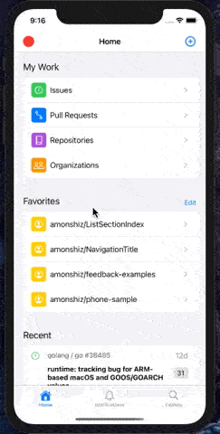

An attempt to recreate the official Github iOS mobile app using SwiftUI. Aside from knowing someone on the team I have no actual knowledge about the app. Everything is my best guess, I don't even bother measuring screenshots. It is all by eye on a 1080p monitor and scaled down, so definitely wrong. :)

Current status

